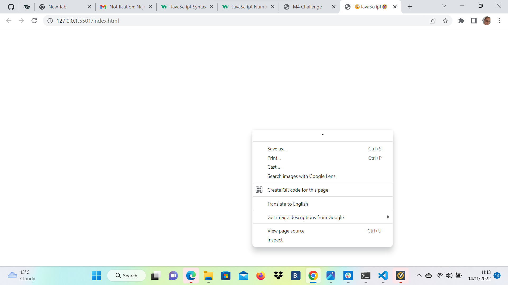
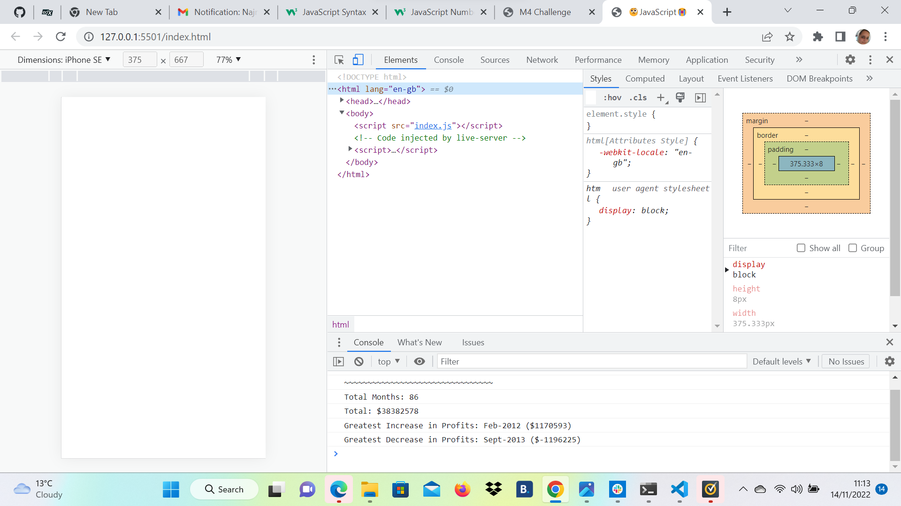
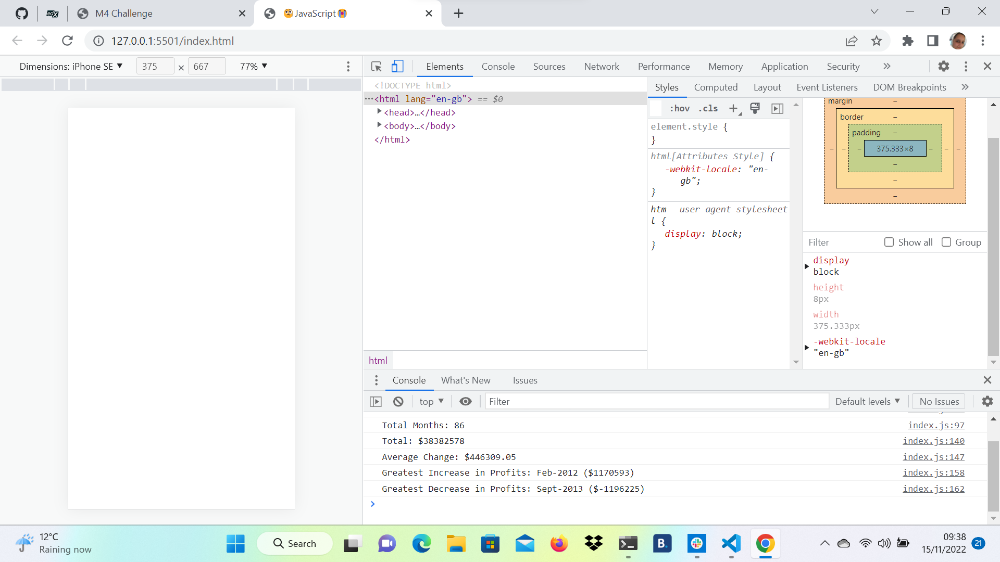

# Console-Finances
As a bootcamp student, we are required to produce financial statement that would mock the example given using javaScript.

# Description

These are criteria given to us and we need to construct the project.

1. Create a new GitHub repo called `Console-Finances`. Then, clone it to your computer.

2. Copy the starter files in your local git repository.
   
You have been given a dataset composed of arrays with two fields, Date and Profit/Losses.

Your task is to write JavaScript code that analyzes the records to calculate each of the following:

* The total number of months included in the dataset.

* The net total amount of Profit/Losses over the entire period.

* The average of the **changes** in Profit/Losses over the entire period.
  * You will need to track what the total change in profits are from month to month and then find the average.
  * (`Total/Number of months`)

* The greatest increase in profits (date and amount) over the entire period.

* The greatest decrease in losses (date and amount) over the entire period.

When you open your code in the browser your resulting analysis should look similar to the following:

```text
  Financial Analysis
  ----------------------------
  Total Months: 25
  Total: $2561231
  Average  Change: $-2315.12
  Greatest Increase in Profits: Feb-2012 ($1926159)
  Greatest Decrease in Profits: Sep-2013 ($-2196167)
  ```

Your final code should print the analysis to the console.

# Getting started

Step 1

I created a new repository on my GitHub account and clone it to my computer using git clone command.

Then I deployed it by using the git add, git commit, and git push commands to save and push my code to my GitHub repository.

I Navigated to my GitHub repository in the browser and then select the Settings tab on the right side of the page.

On the Settings page, scrolled down to the GitHub Pages section. Then, in the section labeled Source, select the main branch as my source.

This led to my webpage viral https://najma53.github.io/Console-Finances

Step 2

First you need to pseudocoding. That is understand the problem in the language you are comfortable with i.e for me its English. Then slice the whole problem to bits and start witing the code in your language. Example if a and b needed to be added, just write sum of a plus b etc. Once psudocoding done, then try writing the code so you can tell your machine to behave that way. My Pseudocoding is inside the index.js file 

Step 3

Once you start writing the code in index.js file, save it. Then open index.html file in browser. Dont panic, it will be blank because it just contains boiler plate. Right click anywhere on it . This is what you should see  select inspect and this is what you should see . In console tab, you will see how your code is working. But dont foget, first you need to do console.log in index.js file to see in console. If confuse please see my index.js file, lots of console.log done.
This is what I got as my final answers  and I am hoping its correct.

# Conclusion
It was interesting assignment, for me it was challenging writing the code and understanding it. Math behind it is understandable but coding was a bit difficult but as I kept doing not that i had any clue. Googling and writing the code helped and certain pieces started falling in places. Google helped a lot. I discovered,  you can do mathMax and mathMin to calculate highest and lowest value in array. Hence I used this reference https://daily-dev-tips.com/posts/javascript-find-min-max-from-array-of-arrays/
to calculate and check if my code is correct. I console.log both ways and I came up with same answers. I have come up with conclusion atleast my Greatest Increase in Profit and my Greatest Decrease in Profit are correct.
I have left my work in index.js file but commented out. Please go ahead and test incase am wrong. I also tried rounding of to two decimal places using Math .round but was unsucessful, it did not work hence tried toFixed method and that worked.
Calculating Average change using this reference https://www.w3resource.com/javascript-exercises/javascript-math-exercise-45.php led me to a number and month in array. Logic tells me it should be abstract number hence didnt use this code of mine. It has been commented out in index.js file incase if anyone wants to try.
I had a great time doing this assignment, I am hoping next person will too. 